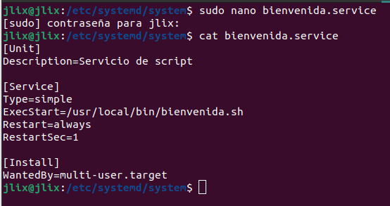

# ACTIVIDAD 3
## 1. Se crea el scrip llamado script.sh
### Aqui creamos un while e imprimimos un mensaje y la fecha actual con una pausa de 1 segundo.
```bash
#!/bin/bash
while true; do
    echo "mensaje que queremos imprimir"
    date
    sleep 1
done
```


## 2. Se Guarda este script en una ubicación conveniente y se le dan los permisos de ejecución al script

En nuestro caso en /usr/local/bin/bienvenida.sh

```bash
sudo chmod +x /usr/local/bin/script.sh
```


## 3. Se crea un archivo en cualquiera de las siguientes ubicaciones
* /etc/systemd/system/
* /lib/systemd/system/

En nuestro caso utilizaremos el directorio /etc/systemd/system

```bash
sudo nano /etc/systemd/system/bienvenida.service
```

Agregamos el contenido al archivo indicando el script a ejecutar

```bash
[Unit]
Description=Alguna descripcion

[Service]
Type=simple
ExecStart=/usr/local/bin/mi_script.sh
Restart=always
RestartSec=1

[Install]
WantedBy=multi-user.target
```


## 4. Habilitar e iniciar el servicio:
```bash
sudo systemctl enable script.service
```
```bash
sudo systemctl start script.service
```


## 5. Verificar el estado y la salida del servicio
```bash
systemctl status script.service
```

### Salida


## 6. Otros
* Parar el servicio
```bash
sudo systemctl stop script.service
```
* Deshabilitar el servicio
```bash
sudo systemctl disable script.service
```
* Reiniciar el servicio
```bash
sudo systemctl restart script.service
```