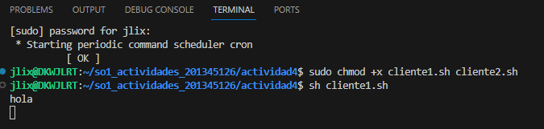
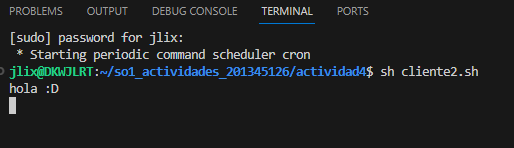
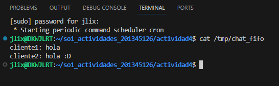

# Named pipes (simulación de chat)

## 1. el script para cada chat
### cliente1.sh
```sh
#!/bin/bash

PIPE=/tmp/chat_fifo

[ -p $PIPE ] || mkfifo $PIPE

while true; do
    read mensaje1
    echo "cliente1: $mensaje1" >> $PIPE 
done
```

### cliente2.sh
```sh
#!/bin/bash

PIPE=/tmp/chat_fifo

[ -p $PIPE ] || mkfifo $PIPE

while true; do   
    read mensaje2
    echo "cliente2: $mensaje2" >> $PIPE
done
```

Donde primero se indica el nombre del pipe fifo, luego se crea el pipe y por ultimo se crea el bucle de lectura.

## 2. Se le brindan los permisos de ejecución a los scripts

```sh
chmod +x cliente1.sh
chmod +x cliente2.sh
```

## 3.Ejecutar los scripts en dos terminales diferentes
```sh

sh cliente1.sh
sh cliente2.sh
```
## 4. Chat de clientes

### Cliente 1


### Cliente 2


## 5. Salida del FIFO

